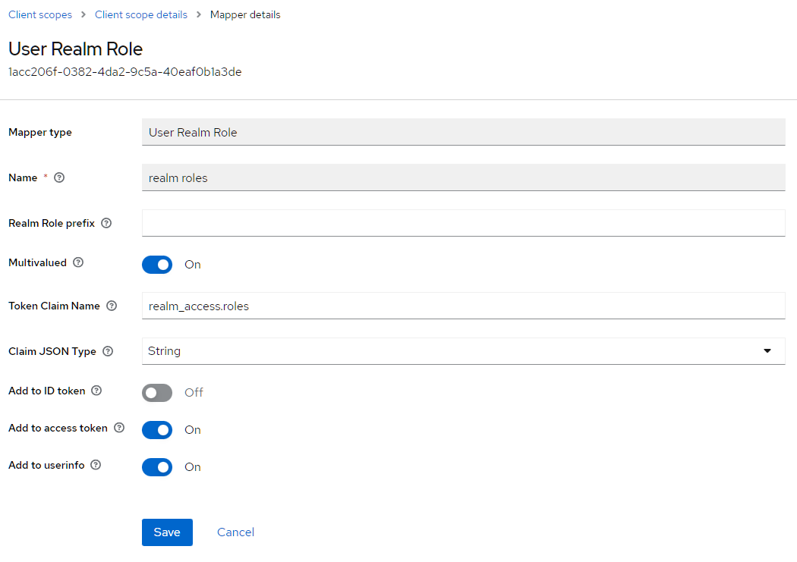

# Vaadin and Keycloak

This project demonstrate the integration of Keycloak with Vaadin.

## Start Keycloak

    docker run -d -p 8180:8080 -e KEYCLOAK_ADMIN=admin -e KEYCLOAK_ADMIN_PASSWORD=admin quay.io/keycloak/keycloak:20.0.1 start-dev

## Configure Keycloak

Next we must create a realm and a user, add roles to the user, and finally, a client.

Create a realm

    Click on the drop-down in the upper left corner and select “Create realm”
    Enter the realm name “vaadin” and save

Create realm roles

    Select “Realm roles” in the menu
    Click “Create role”
    Enter the role name “admin” and save
    Repeat steps 1 to 3 with the role “user”

Create users

    Select “Users” in the menu
    Click on “Create new user”
    Enter the user name “admin”
    Click on “Create”
    Select the tab “Credentials” and set a password
    Disable “Temporary” to prevent having to update the password on the first login
    Click “Save”
    Select the tab “Role mapping”
    Click on “Assign role”
    Choose the previously created roles “admin” and “user”
    Do the same for the user with username “user” but add only the role “user”

Create a client

    Select “Client” in the menu
    Click on “Create client”
    Enter the client id “vaadin”
    Click next and the save
    In the “Access settings” set
        “Valid redirect URIs” to http://localhost:8080/*
        “Web origins” to http://localhost:8080

Important: Role Mapping

Now comes a crucial step. We must disable the role mapping to the ID token. When I created the example, the roles were missing in the application, but thanks to Thomas Vitale’s answer on StackOverflow, I found the solution.

    Select “Client scopes”
    Select the client scope “roles”
    Click on the tab “Mappers”
    Select “realm roles”
    Disable “Add to ID token”

The configuration must look like this:

## Running the application

The project is a standard Maven project. To run it from the command line,
type `mvnw` (Windows), or `./mvnw` (Mac & Linux), then open
http://localhost:8080 in your browser.

You can also import the project to your IDE of choice as you would with any
Maven project. Read more on [how to import Vaadin projects to different 
IDEs](https://vaadin.com/docs/latest/guide/step-by-step/importing) (Eclipse, IntelliJ IDEA, NetBeans, and VS Code).

## Deploying to Production

To create a production build, call `mvnw clean package -Pproduction` (Windows),
or `./mvnw clean package -Pproduction` (Mac & Linux).
This will build a JAR file with all the dependencies and front-end resources,
ready to be deployed. The file can be found in the `target` folder after the build completes.

Once the JAR file is built, you can run it using
`java -jar target/keycloak-1.0-SNAPSHOT.jar`

## Project structure

- `MainLayout.java` in `src/main/java` contains the navigation setup (i.e., the
  side/top bar and the main menu). This setup uses
  [App Layout](https://vaadin.com/docs/components/app-layout).
- `views` package in `src/main/java` contains the server-side Java views of your application.
- `views` folder in `frontend/` contains the client-side JavaScript views of your application.
- `themes` folder in `frontend/` contains the custom CSS styles.

## Useful links

- Read the documentation at [vaadin.com/docs](https://vaadin.com/docs).
- Follow the tutorials at [vaadin.com/tutorials](https://vaadin.com/tutorials).
- Watch training videos and get certified at [vaadin.com/learn/training](https://vaadin.com/learn/training).
- Create new projects at [start.vaadin.com](https://start.vaadin.com/).
- Search UI components and their usage examples at [vaadin.com/components](https://vaadin.com/components).
- View use case applications that demonstrate Vaadin capabilities at [vaadin.com/examples-and-demos](https://vaadin.com/examples-and-demos).
- Build any UI without custom CSS by discovering Vaadin's set of [CSS utility classes](https://vaadin.com/docs/styling/lumo/utility-classes). 
- Find a collection of solutions to common use cases at [cookbook.vaadin.com](https://cookbook.vaadin.com/).
- Find add-ons at [vaadin.com/directory](https://vaadin.com/directory).
- Ask questions on [Stack Overflow](https://stackoverflow.com/questions/tagged/vaadin) or join our [Discord channel](https://discord.gg/MYFq5RTbBn).
- Report issues, create pull requests in [GitHub](https://github.com/vaadin).
